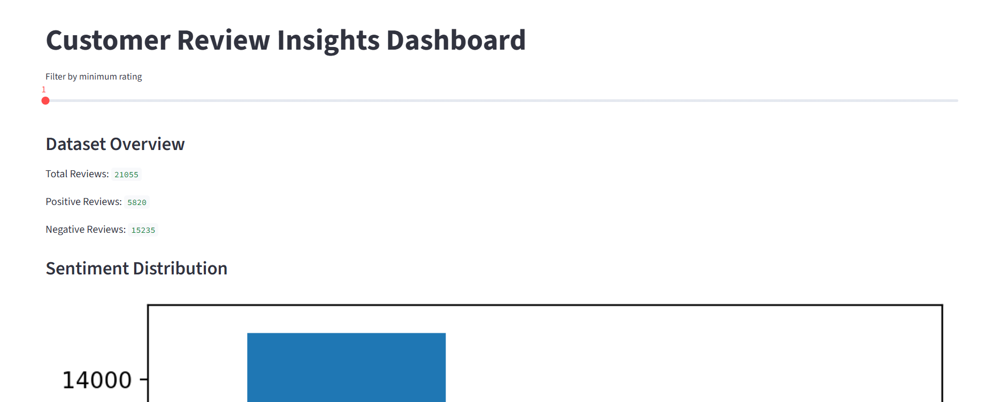

# Customer Review Insights Dashboard

An NLP and machine learning project that analyzes customer reviews to extract sentiment trends and business insights through an interactive dashboard.

## Features
- Sentiment classification using Machine Learning
- Customer review analytics
- Negative keyword extraction
- Interactive Streamlit dashboard
- Data visualization and reporting

## Tech Stack
- Python
- Pandas
- Scikit-learn
- Streamlit
- Matplotlib

## Project Workflow

1. Data Cleaning and Preprocessing
2. Sentiment Classification
3. Insight Extraction
4. Dashboard Visualization

## Dashboard Preview



## Run Locally

```bash
pip install -r requirements.txt
streamlit run app.py
```

## Future Enhancements
- LLM-powered review summarization
- Real-time sentiment monitoring
- Cloud deployment

## Author
Sindhushree N
